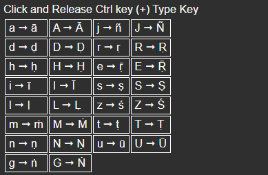

# Diacritics for Sanskrit Transliteration

It is a small desktop app which allows to easily type Diacritics on Windows using [Rust](https://www.rust-lang.org/) ,[Tauri](https://tauri.app/) , [InputBot](https://github.com/obv-mikhail/InputBot) and [Enigo](https://github.com/Enigo-rs/Enigo) 

## How to Install 

- Go to [Releases](https://github.com/Kallz02/sanskrit-transliteration/releases)

- Click on .Exe of Desire Version

## Contact 

Contact me for additional characters or if you face any issues

Email: akshay.pranav.kalathil@gmail.com

https://akshayk.dev/contact